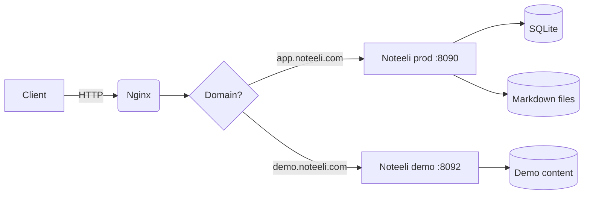
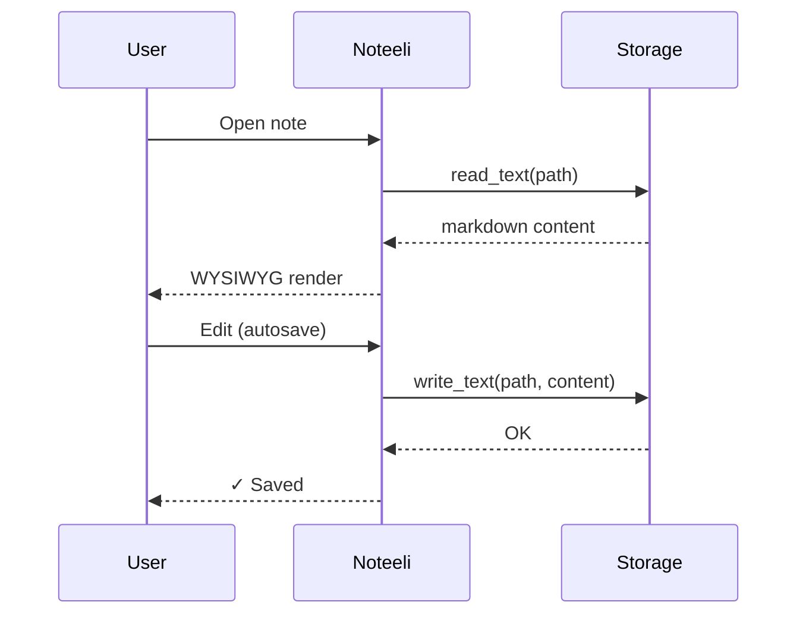
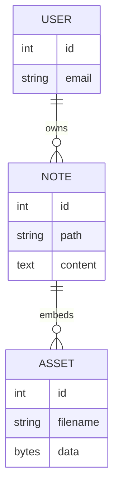
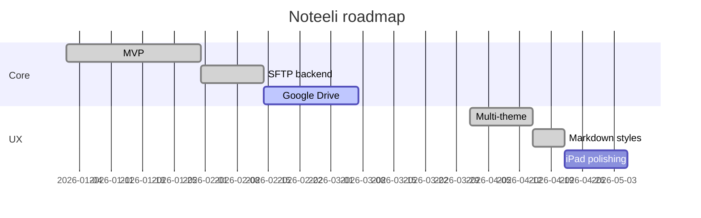
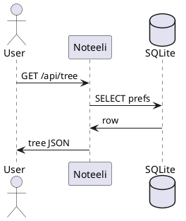

# Diagrams in Noteeli

Noteeli renders **Mermaid** (locally, in the browser) and **PlantUML**
(via the public plantuml.com renderer).

## Flowchart

## Sequence

## ER diagram

## Gantt

## PlantUML — optional

> 💡 When you edit a document in WYSIWYG mode, diagrams render live.
> The `mermaid` language hint on a code block tells the editor to
> render it as a diagram instead of showing the source.
