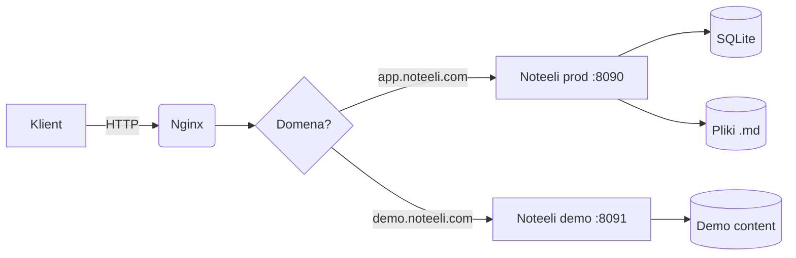
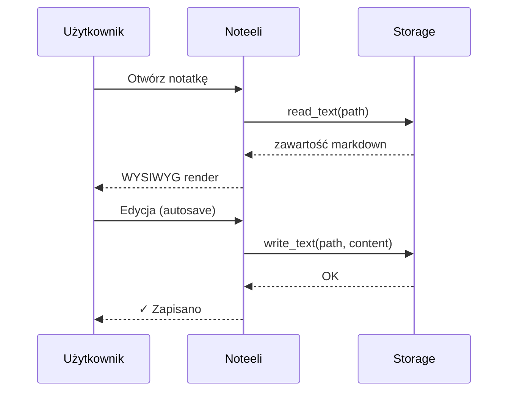
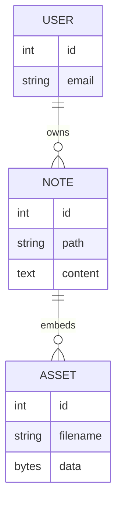
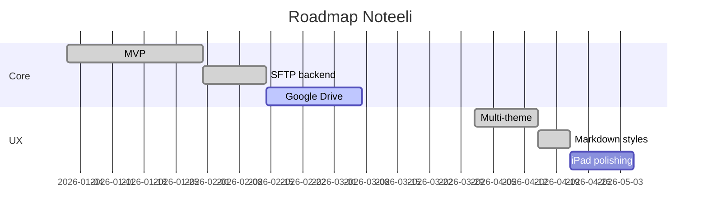
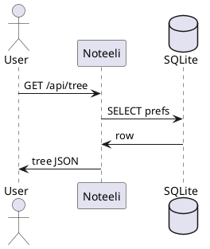

# Diagramy w Noteeli

Noteeli renderuje **Mermaid** (lokalnie, po stronie klienta) oraz
**PlantUML** (przez publiczny renderer plantuml.com).

## Schemat blokowy (flowchart)

## Sekwencja

## Diagram ER

## Gantt

## PlantUML — opcjonalnie

> 💡 Gdy edytujesz dokument w trybie WYSIWYG, diagramy renderują się
> na żywo. Pole `mermaid` w nagłówku bloku kodu mówi edytorowi,
> że ma to zrenderować jako diagram zamiast pokazywać kod.
